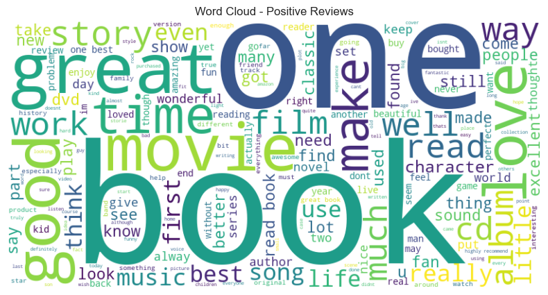
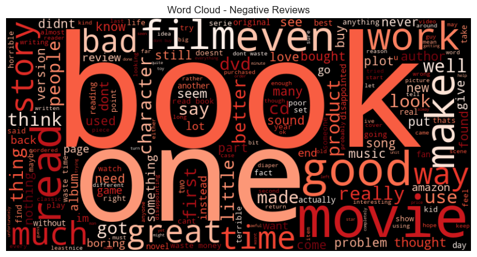
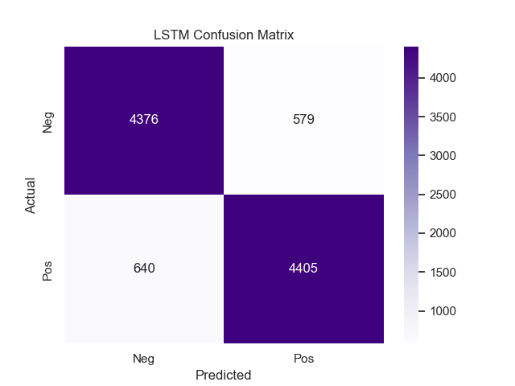
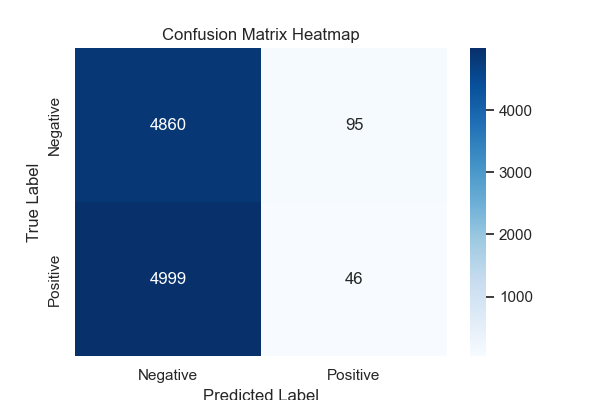

# Sentiment Analysis of Amazon Product Reviews

This project applies Natural Language Processing (NLP) techniques to classify product reviews as either positive or negative. Two models were implemented: a deep learning-based LSTM model and a pre-trained BERT transformer model. Evaluation was performed using classification metrics and visualizations such as confusion matrices and word clouds.

## 📁 Dataset
- **Source:** Amazon Product Reviews (Video Games category)
- **Format:** `.tsv` file with two columns: `text` (review), `label` (1 = positive, 0 = negative)

## 🧠 Models Used

### 1. LSTM Model (Keras)
- Tokenization and padding with TensorFlow/Keras.
- Embedding layer, LSTM layer, and Dense output.
- Trained for binary classification.

### 2. BERT Model (Transformers)
- Pre-trained `bert-base-uncased` model from Hugging Face.
- Fine-tuned using PyTorch and Hugging Face `Trainer`.
- Used `BertTokenizer` for tokenization.

## 📊 Evaluation
- **Metrics:** Accuracy, Precision, Recall, F1-score.
### Sample Results:
- **LSTM Accuracy:** ~0.85
- **BERT Accuracy:** ~0.91

- BERT outperformed LSTM with slightly higher accuracy and F1-score.
- Both models show strong performance on this binary classification task.


- **Visualizations:** Word clouds and confusion matrices.


## 🔍 Methods

We applied two models:
- A Logistic Regression with TF-IDF features.
- A BERT transformer model fine-tuned for binary sentiment classification.

## 📊 Visualizations

### 🔠 Word Clouds

- **Positive Reviews**  
  The word cloud below represents the most frequent words found in positive reviews. Common positive sentiment words (e.g., "love", "great", "excellent") appear prominently.

  

- **Negative Reviews**  
  This word cloud highlights commonly used terms in negative reviews, often associated with dissatisfaction such as "bad", "poor", "disappointed".

  

  



### 🧮 Confusion Matrix

The confusion matrix below visualizes the performance of the model on the test set, showing:
- **True Positives**: Correctly predicted positive reviews
- **True Negatives**: Correctly predicted negative reviews
- **False Positives** and **False Negatives** for model misclassifications.

  


## 📦 Folder Structure
```
.
├── SentimentAnalysis.ipynb
├── README.md
├── requirements.txt
├── IMAGES/
│   ├── wordcloud_positive.png
│   ├── wordcloud_negative.png
│   ├── lstm_confusion_matrix.png
│   └── bert_confusion_matrix.png
├── models/
│   ├── best_lstm_model.keras
│   └── best_bert_model.pt
```

## ✅ How to Run

1. Clone this repo:
```bash
git clone https://github.com/yourusername/sentiment-analysis-bert-lstm.git
cd sentiment-analysis-bert-lstm
```

2. Install requirements:
```bash
pip install -r requirements.txt
```

3. Open the notebook and run all cells:
```bash
jupyter notebook SentimentAnalysis.ipynb
```

## 🧾 Requirements
See `requirements.txt` for full list. Main libraries:
- pandas, numpy, matplotlib, seaborn
- scikit-learn
- tensorflow
- torch
- transformers
- wordcloud

## 📚 License
MIT License